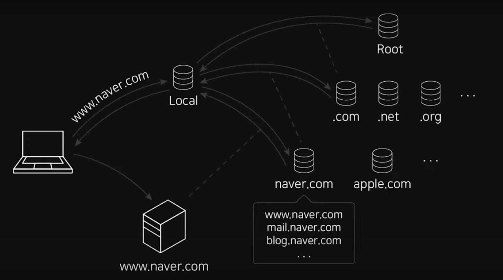

# DNS가 뭔가요? + 도메인, A Record, CName

## 1. DNS란?

* 도메인이란 ?
  * www.naver.com
    * naver.com이 도메인, www.는 host name이라고 부른다.
      * blog.naver.com
      * mail.naver.com
      * 위와 같이 host name은 www뿐 아니라 다른 것들도 존재할 수 있다.

* DNS란?
  * IP에 mapping되는 값들을 도메인에 저장한다.
  * 비유로하자면 전화번호부, 도메인 - IP 주소 매핑 정보는 DNS에 있다. 

* 도메인 정보들은 위처럼 다층적 네트워크에 분산돼서 저장되고, 조회된다.

## 2. www.naver.com를 치면 일어나는 일

1. www.naver.com 입력
   * 해당 주소값을 모른다.
   * 브라우저는 먼저 PC에 설정된 local DNS Server에 해당 domain과 host name의 ip address를 조회한다.
     * DNS Server = Name Server 라고 불리기도 한다.
   * 해당 local dns 서버는 보통 통신사마다 지정된 곳이 존재한다.
     * 사용자가 다른 곳으로 바꿀 수도 있다.

2. 만약 local dns server에 해당 값이 없다.
   * Root DNS Server에 해당 IP 주소를 찾아달라고 요청을 보낸다.
     * Root DNS Server는 전세계 13개정도가 있다.
   * Root
   * .com
   * .naver.com
     * www.naver.com
     * mail.naver.com
     * blog.naver.com

## 3. DNS 취약점

* DNS 스푸핑(spoofing)
  * 해커들의 공격 대상이 되기도 한다.
  * Local DNS Server에 값을 물어볼 때, 중간에 값을 탈취해서 다른 IP 주소를 반환한다.

## 4. Local DNS Server Custom

* 언제,왜 Custom 하는가?
  * 로컬 DNS 서버는 일반적으로 통신사(ISP) 것으로 세팅돼있다.
  1. 그래서 정부에서 막아놓은 사이트에 접속할 때 사용하려고 사용한다.
    * 비유하자면, 국가에서 검열받은 전화번호부 대신 외국 전화번호부를 사용한다는 것이다.
  2. Youtube등 해외 사이트 이용시 더 빠르게 사용하려고 사용한다.
     * 아래 사진과 같이 세팅하면 youtube이용시 더 빠르게 이용이 가능하다.

## 5. A Record , CNAME

### 5-1) A Record

* 서버의 도메인을 IP와 직접 연결한다.
* IP로의 직접 연결한다.

### 5-2) CNAME ( canonical name )

* 서버의 도메인을 별명과 연결한다.
* IP가 유동적으로 변하는 서버의 경우, 바뀌는 IP들에 일정하게 연결되는 다른 도메인(canonical name)을 적어준다.
  * AWS나 파이어베이스로 서버 생성시 아래와 같이 주소를 제공해준다.
  * 해당 주소를 도메인에 연결해준다.
* CNAME같은 경우 한 군데를 더 걸쳐서 속도가 상대적으로 느릴 수 있다.

* [DNS가 뭔가요? + 도메인, A Record, CName](https://www.youtube.com/watch?v=6fc9NAQkcv0&ab_channel=%EC%96%84%ED%8C%8D%ED%95%9C%EC%BD%94%EB%94%A9%EC%82%AC%EC%A0%84)
* date
  * 22.07.16