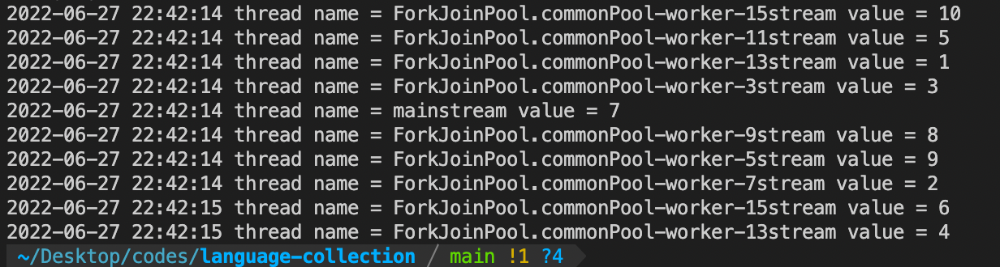
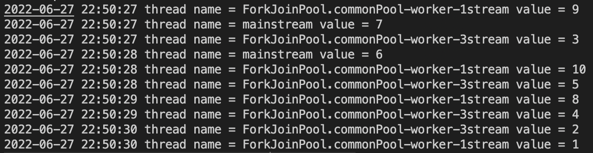

# 6장 병렬 프로그래밍 (Parallel Programming)

## 1. 병행과 병렬, 분산

* 병행 : Concurrency(동시성)
  * 하나의 Cpu내에서 Thread1 -> Thread2 -> Thread1 -> Thread2 -> ... 작업하는 방식
* 병렬 : Parallel
  * 여러 개의 CPU안에서 각각의 Thread가 하나의 CPU를 갖고 작업하는 방식
    * 그러나 병렬 안에서 다시 병행이 이뤄지기 때문에, 엄밀히 구분하기엔 무리가 있다.
* 분산 : Distribute
  * 여러 대 서버에 나눠서 작업진행

## 2. Concurrent API란?

> * 개발자들이 병렬 프로그래밍을 쉽게 할 수 있도록 만든 고수준의 API
> * java.util.concurrent에 위치

### 2-1) Package

* 실행자(Executor)
  * Concurrent API에서 작업을 수행하는 역할
* 큐(Queues)
  * Concurrent API에서 제공하는 큐는 멀티 스레드 환경에서 안정성을 보장함
* 타이밍(Timing)
* 동기화(Synchronizers)
* Concurrent Collections
* Memory Consistency Properties

## 3. Executors class

> * [Executor](./Executor1.java)

* `Executor` <- `ExecutorService` <- `ScheduleExecutorService`
  * Executor : 기본
  * ExecutorSerice : 생명주기 관리 추가
  * ScheduleExecutorService : 주기적 실행 추가

* `Executors` 의 Static메서드를 통해 `ExecutorService`객체들을 반환하는 방식으로 동작한다.

## 4. ExecutorService

> * [ExecutorService](./ExecutorService2.java)
> * [DelayedTask](./DelayedTask3.java)

* 가장 많이 사용되는 핵심 인터페이스
* 메서드
  * `newSingleThreadExecutor`
    * 하나의 쓰레드만
  * `newFixedThreadPool`
    * 쓰레드 수 제한
    * parameter로 넘긴 수 만큼 제한된다.
  * `newCachedThreadPool`
    * cache이용
    * 등록된 스레드 한 번에 실행
  * `newWorkStealingPool`
    * 모든 CPU 코어를 사용하도록
  * `unconfigurableExecutorService`
    * ExecutorService의 메서드만 호출하고 나머지는 사용하지 못하게 할 때 사용

## 5.ExecutorService <- *ScheduledExecutorService*

> * [PeriodTask](./PeriodTask4.java)

> 특정 시간 이후 실행하도록 설정 가능

* 메서드
  * `newScheduledThreadPool`
    * 일정 시간 간격
  * `newSingleThreadScheduledExecutor`
    * 실행시간이 지정되더라도 실행 중인 쓰레드가 종료된 이후 실행
  * `unconfigurableScheduledExecutorService`
    * ExecutorSerivce 외 나머지 기능을 제한할 필요가 있을 때

### 5-1) Schedule method overloading

*Parameter*
  1. 실행되는 동작
  2. 딜레이 ( 처음 딜레이, 이후에 주기적 나중 딜레이 )
  3. 시간단위

* 한 번만 실행
  * `schedule(Runnable r, long delay, TimeUnit unit)`
  * `schedule(Callable<V> callable, long delay, TimeUnit unit)`
* N번 실행 (무한)
  * `scheduleWithFixedDelay(Runnable r, long initDelay, long delay, TimeUnit unit)`
    * initDelay이후 쓰레드 작업 종료 후 delay 만큼 있다가 다음 쓰레드 작업 실행
  * `scheduleAtFixedRate(Runnable r, long initDelay, long delay, TimeUnit unit)`
    * initDelay이후 **쓰레드 작업 종료와 상관없이** delay 주기로 다음 쓰레드 작업 실행

### 5-2) TimeUnit

* DAYS, HOURS, MINUTES, SECONDS, MILLISECONDS, MICROSECONDS, NANOSECONDS
* seconds 이후 1/1000씩 감소
* 기존 sleep
  * `Thread.sleep(1000)`
  * 쓰레드를 이용한 sleep은 기준이 Milliseconds라 직관적이지 않다.
* TimeUnit Sleep
  * `TimeUnit.SECONDS.sleep(1)`
    * 1초 대기

## 6. Future

> * [FutureExample](./FutureExample7.java) 

* Future interface란?

> 비동기 연산 작업의 결과를 손쉽게 확인할 수 있는 인터페이스

* `Callable`
  * Runnable과 마찬가지로 멀티 스레드 기반으로 동작하기 위한 인터페이스
    * Runnable은 메서드가 void형인 run method만 존재하기 때문에 실행결과를 return하지 않는다.
      * 만약 결과값이 존재한다면 callable을 이용해야만 한다.

## 7. CompletableFuture

> * [CompletableFuture](./CompletableFuture8.java)
> * [InsuranceEX1](./InsuranceCalculatorBasic9.java)
> * [InsuranceEX2](./InsuranceCalculatorExtend10.java)

> 💡 java 멀티 스레드 프로그래밍의 최종 결과물<br/>
> 솔직히 잘 이해는 안된다.. 나중에 프로젝트에 적용해야 할 때가 있으면 다시 보면 좋을 것 같다.

* `runAsync` 혹은 `supplyAsync`를 통해서 작업을 시작한다.
* `thenRun`, `thenAccpt`를 통해 다음 메서드를 수행한다.
* 다 끝나면`complete`로 return 할 수 있다.

## 8. Stream 병렬처리

### 8-1) 병렬처리

> * [InsideParallelStream: 병렬 스트림 기본 예제](./InsideParallelStream12.java)

스트림에서 제공하는 `parallelStream()` 메서드를 통해 손쉽게 병렬처리를 할 수 있다.
* 이 때, stream의 data처리를 할 때 순서가 중요하다면 병렬처리를 하면 안된다.
  * 병렬처리를 순서를 보장하지 않는다.
  * 예를들어 `reduce()` 연산이라면 순서를 보장하지 않아도 상관없기에, `reduce()` 같은 경우엔 병렬 처리를 하는 것이 도움된다.

해당 `parallelStream()`은 2가지 특징을 갖는다.
1. 해당 PC나 서버의 코어 수에 따라 스레드가 생성된다.
2. 만약 4개의 스레드가 생성됐다고 하면, 하나만 이름이 main이고 나머지는 `ForkJoinPool` 스레드로 생성된다.
   * 코어 수 기반 스레드는 Stream에서 제어한 것이 아니라, `Concurrent API`의 `ForkJoinPool`의 기본값에 영향을 받은 것이다.
   * 

### 8-2) 병렬처리 Custom

> * [InsideParallelStream: Thread 수 custom 방법1](./InsideParallelStreamCustom13.java)
> * [InsideParallelStream: Thread 수 custom 방법2](./InsideParallelStreamCustom2_14.java)

`parallelStream()` 으로 생성된 병렬 스트림은 PC혹은 서버의 CPU 코어 수 만큼 생성되고, 전체 CPU 자원을 선점한다.
그러므로 병렬 처리시 다른 서비스에 영향을 줄 수 있으므로, 스레드 개수를 제어할 필요가 있다.

방법은 아래와 같이 2가지가 존재한다.
1. ForkJoinPool의 기본 스레드 값을 변경
2. ForkJoinPool이 아닌 다른 스레드 풀을 사용

#### ForkJoinPool의 기본 스레드 값을 변경

```java
System.setProperty("java.util.concurrent.ForkJoinPool.common.parallelism","2");
System.out.println("thread pool size = " + ForkJoinPool.getCommonPoolParallelism());
```

위의 코드와 같이 `System.setProperty()` 를 통해 기본 값을 변경한다.
* 위의 방법은 책정리.다재다능코틀린프로그래밍.codes.main 메서드 외 추가적으로 2개의 메서드가 생성된다.
* 

* `ForkJoinPool` 의 기본값을 변경하는 것이기 때문에 JVM 전체에 영향을 미친다.
  * 특정한 프로세스 혹은 스레드에 대해서만 변경할 수 없으며, JVM이 종료될 때까지 설정이 유효하다.

#### 사용자 정의 풀을 사용

```java
ForkJoinPool customPool = new ForkJoinPool(2)
customPool.submit(()->{
...
}).get()
```

이 코드는 책정리.다재다능코틀린프로그래밍.codes.main 메서드가 존재하지 않고, `ForkJoinPool` 의 parameter로 넘긴 값만큼만 스레드가 생성되기 때문에 좀 더 직관적이나,코드가 좀 더 복잡할 수 있다.

### 8-3) parallel & sequential

순차처리와 병렬처리를 섞어서 사용할 수 있다.

```java
list.stream().limit(100).parallelStream().reduce(Integer::sum)
```

앞의 100개에 대해서 자르는 것은 순차성이 필요하고, 뒤에 `reduce()` 연산같은 경우 순서가 상관없기에 병렬처리를 하는 것이 더 효율적이다.

