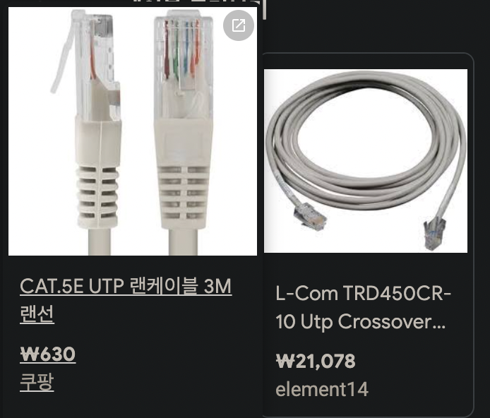

# 2장 신호의 전송과 충돌

## 1. 1계층의 역할과 개요

* 역할
  * 케이블에 연결돼 있는 기기에 data를 전달하는 것
  * 2계층부터는 데이터를 보내기전에 어떤 일을 할 지, 데이터를 받은 이후에 어떤 일을 할 지에 대한 역할이다.

* 전기신호 선(유선)
  * 동선
    * 동선 케이블 -> UTP
      * 8개의 동선이 뭉친 케이블
      * 2개가 1쌍으로 돼 있다.
        * 광파이버 케이블도 많이 보급됐지만, 아직은 UTP가 압도적으로 많다.
  * 광파이버
    * 광신호 사용

* UTP 이미지

## 2. 신호와 충돌

* 인터페이스의 역할
  * 비트를 신호로, 신호를 비트로 변환하는 기기

* 통신속도
  * 1초 동안 전해지는 비트 수 (bps - bit per second)
    * 여러 비트가 표현되게 하고, 비트를 짧게 보내서 여러 비트를 보내면 통신속도가 늘어난다.
      * 대신 이렇게 하면 수신쪽에서 제대로 인식하지 못하거나, 에러 확률이 높아진다.

* 증폭
  * 장거리 신호 운반의 경우 증폭이 필요하다.
  * 감쇠, 노이즈, 충돌 등의 위협이 있기 때문이다.

## 3. 허브

* 허브의 역할
  * 허브에 케이블로 연결 돼 있는 기기들은 동일 케이블에 연결 돼 있는 효과를 받는다.
    1. 허브는 신호의 증폭과 재생의 역할을 한다.
    2. 허브는 복수의 기기를 연결해서 네트워크를 구축한다.

* flooding(플러딩)
  * 허브는 수신한 포트 이외의 모든 포트에 수신한 신호를 송신한다.
  * 이렇게 들어온 거를 다 쏴버리면 충돌이 발생할 수 있다.
    * 그래서 허브에서 충돌 도메인이 생긴다.

* 충돌 도메인
  * 신호를 받으면 충돌이 발생할 지도 모르는 범위를 의미한다.
  * 허브는 수신한 신호에 대해서 어떠한 간섭도 하지 않는다.
  * 그래서 허브에 연결된 기기들에 대해서 충돌 도메인이 발생할 확률이 높아진다.
    * 당연하게도 충돌 도메인은 작을 수록 좋다.

## 4. 2계층

* 2계층의 역할
  * 세그먼트 범위에서의 데이터 전송
    * 세그먼트 : 패킷 교환없이 신호가 닿는 범위
  * 세그먼트를 넘은 데이터는 패킷 교환기인 라우터를 통해서 보낸다. 즉, 3계층 이상의 일이다.

* 신호 규격
  * 1계층의 신호와 케이블에 따라 2계층 규격도 달라진다.
    * 즉, LAN용, WAN용이 다르다.
    * 해당 책은 LAN용에 대해서만 설명한다.
    * LAN의 사실상 표준은 ethernet이다.

* 프레이밍(framing)
  * 송수신되는 신호를 데이터로 인식할 수 있게 해준다.
    * 예를 들어, 프레이밍 안에 프리엠블(preamble)이라는 것이 있다.
      * 해당 신호를 통해 신호의 시작점을 알 수 있다.
    * 이는 비트를 읽는 시점이 송신측과 수신측이 일치해야하므로 사용하는 것이다.

## 5. 데이터 전송 방법

* 3가지 cast
  * 유니 캐스트
    * 1대1
  * 브로드 캐스트
    * 1대 전체
    * 세그먼트 내 모든기기에게 전송
  * 멀티 캐스트
    * 1대 N

* 유니캐스트 && 멀티캐스트 주소
  * 각각의 기기는 적어도 유니 캐스트 주소를 적어도 하나 갖고 있다.
  * 해당 유니캐스트 주소는 인터페이스마다 유일하다.
  * 반면 멀티캐스트 주소는 유일하지 않아도 된다. 그룹번호처럼 관리된다.
    * 멀티 캐스트 그룹에 있는 기기는 유니캐스트 주소, 멀티캐스트 주소, 즉 최소 2개를 갖고 있다.

* MAC 주소
  * 이더넷에서 사용되는 주소
  * 앞 24비트, 뒤 24비트로 총 48비트로 구성
    * 앞 24비트는 제조사번호 (벤더코드)
    * 뒤 24비트는 임의의 식별번호

* 참조
  * LAN ->(사실상표준) 이더넷 -> MAC주소(48비트)

## 6. 이더넷

* 이더넷 프레임

| 헤더                                   | payload           | 트레일러(FCS) |
| -------------------------------------- | ----------------- | ------------- |
| 수신처 MAC 주소, 송신처 MAC 주소, 타입 | PDU (이전 데이터) | 에러 체크용   |

* FCS
  * Frame Check Sequence

* 이더넷의 동작 방식
  * 허브는 기본적으로 플러딩을 한다.
  * 그렇기 때문에 자신에게 온 프레임이 아닌 프레임은 모두 파기한다.

* CSMA/CD
  * 충돌이 일어나지 않도록 CSMA/CD 방식을 사용한다.
  * CS: 송신중이면 보내지 않는다.
  * MA: 아무도 송신하지 않으면 보낸다.
  * CD: 충돌시 재전송한다.
  * 그러나 이런 CSMA/CD를 써도 충돌이 발생한다.
    * CSMA/CD는 충돌을 막는 게 아니라, 충돌 확률을 줄여주는 것이다.
    * 기기 2대가 동시에 신호를 받은 경우, 동시에 송신할 수 있기에 충돌이 발생할 수 있고, 기기가 많을 수록 충돌 확률이 올라간다.

## 7. 스위치

* 충돌 도메인을 피하는 방법
  1. 타이밍 겹치지 않게 하기
  2. 길을 나누기
     * 스위치의 방법

* 충돌 발생 지점
  * LAN에서 사용되고 있는 UTP나 광케이블은 수신, 송신 지점이 나눠져 있기 때문에 충돌이 발생하지 않는다.
  * 충돌이 발생하는 것은 허브 내부이다.
  * 허브는 동시에 신호를 2개 이상 받았을 때 해당 신호를 나누는 방법이 없기 때문이다.

* 수신한 프레임 나누기
  * MAC 주소 필터링
  * 버퍼링

* MAC 주소 필터링
  * 학습
    * 수신한 프레임의 송신 MAC 주소 - 수신한 Port를 연결
    * 해당 테이블을 Address Table이라고 한다.
      * 한 번 테이블을 만들면, 신호가 왔을 때 해당 MAC 주소가 있는 포트에만 신호를 수신한다.
  * 스위칭
    * 학습 이후 매핑된 주소에만 프레임을 보내는 것을 스위칭이라고 한다.
  * 플러딩의 발생
    * 스위치도 허브처럼 플러딩이 발생할 수 있다.
      * MAC 주소를 처음 학습하기 전
      * 멀티캐스트, 브로드캐스트 신호 수신
    * 위 두가지 상황에서는 플러딩이 발생한다.

* 버퍼링
  * 버퍼란?
    * 일시적으로 데이터를 기록할 수 있는 메모리
  * 수신처가 다른 프레임이 동시에 스위치에 도달한 경우에는 스위칭을 통해 충돌을 낮춘다.
    * 수신처가 같은 경우, 같은 포트에 동시에 프레임이 도달할 수 있다.
    * 이 때 버퍼에 임시저장을 해서, 먼저 들어간 신호의 송신이 끝나면 이후에 버퍼에 저장된 신호를 처리하는 방법을 버퍼링이라고 한다.
  * 버퍼의 용량은 유한하기에, 만약 버퍼의 용량이 꽉 찼다면 송신을 중단시킨다.
    * (백 프래셔(Back Pressure), IEEE802.3x 규약에 의거)

* 전이중 통신(Full Duplex), 전이중 이더넷
  * CSMA/CD 방식은 반이중 통신 방식이다.
    * 하나가 송신할 때 다른 기기들은 송신할 수 없기에, 100mpbs의 속도가 나오는 케이블에 100대의 기기가 연결 돼 있다면 1대씩 밖에 못 보내기에 속도는 100mpbs/100 이 나오게 된다.
    * 하나가 통신할 때 다른 하나가 못하는 방식을 반이중 통신 방식이라고 한다.
  * 반면 스위치의 경우 송신과 수신을 동시에 할 수 있으므로(전이중 통신, Full Duplex), 케이블의 속도를 그대로 활용할 수 있다.
    * 스위치를 통해 전이중 통신을 하는 것을 전이중 이더넷이라고 한다.
  * 현재는 스위치가 보급돼서 전이중 이더넷이 당연하게 됐다.

